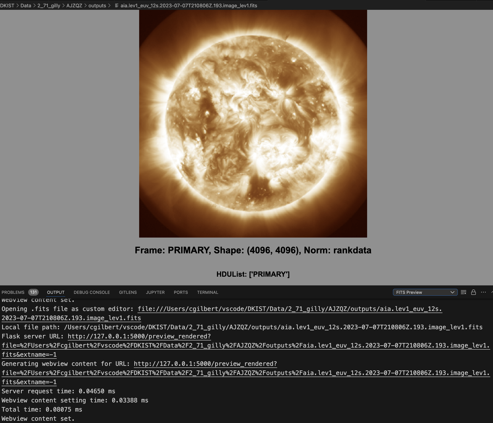
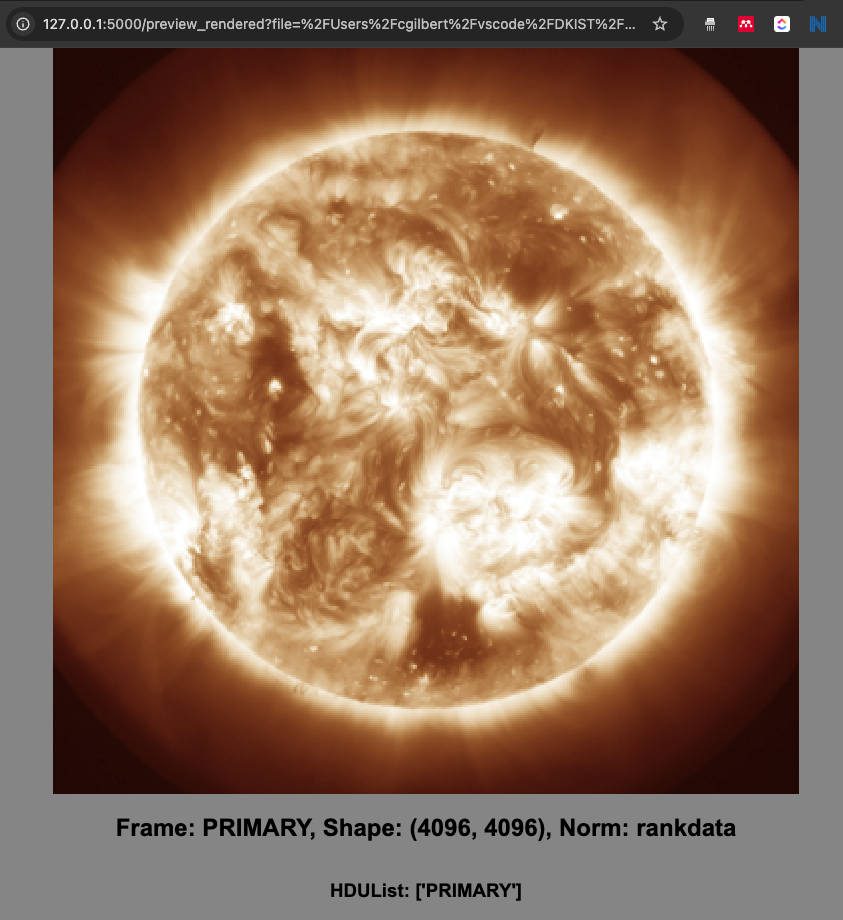
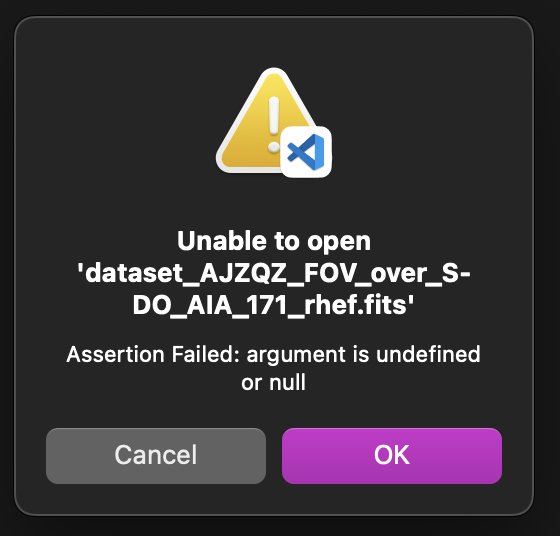

# pyFitsVSC
This extension allows the user to preview FITS files directly from VSC without having to render them to PNG manually or worry about scaling and plotting settings.

This is what the window looks like when you click a *.fits file in the VSCode explorer sidebar:


Cmd+clicking on the URL that is generated will open the preview in a browser, too!


## Description
`pyFitsVSC` is a VS Code extension designed to provide previews of FITS files seamlessly within the editor. The extension contributes the `pyfitsviewer` custom editor to display FITS file contents.

## Requirements

This extension runs using the `pyFitsServer` backend located at [https://github.com/GillySpace27/pyFitsServer](https://github.com/GillySpace27/pyFitsServer). You'll need to install that separately and confirm that it is running before this extension will work.

### Installation of pyFitsServer
To install and run `pyFitsServer`, follow these steps:

1. **Clone the repository**:
    ```bash
    git clone https://github.com/GillySpace27/pyFitsServer.git
    ```
2. **Navigate to the directory**:
    ```bash
    cd pyFitsServer
    ```
3. **Install the dependencies**:
    ```bash
    pip install -r requirements.txt
    ```
4. **Run the server**:
    ```bash
    python server.py
    ```

5. **Confirm the server is running properly by running tests (from the project root)**:
    ```bash
    pytest
    ```

## Installation of pyFitsVSC
It's recommended to install `pyFitsVSC` from a precompiled `.vsix` file provided by the developer to avoid complications with compiling from source.

### Installing from the Precompiled VSIX File
1. **Download the precompiled `.vsix` file provided by the developer.**
2. **Open VS Code.**
3. **Go to Extensions view (`Ctrl+Shift+X`).**
4. **Click the three-dot menu (`...`).**
5. **Select `Install from VSIX...`.**
6. **Browse to and select the downloaded `.vsix` file.**

### Compiling and Packaging from Source
If you need to compile and package `pyFitsVSC` from source, follow these steps:

1. **Clone the repository**:
    ```bash
    git clone https://github.com/GillySpace27/pyfitsvsc.git
    ```
2. **Navigate to the directory**:
    ```bash
    cd pyfitsvsc
    ```
3. **Install VSCE**:
    ```bash
    npm install -g vsce
    ```
4. **Compile TypeScript Code**:
    ```bash
    npm run compile
    ```
5. **Package the extension**:
    ```bash
    vsce package
    ```
6. **Install the VSIX file**:
    - Open VS Code
    - Go to Extensions view (`Ctrl+Shift+X`)
    - Click the three-dot menu (`...`)
    - Select `Install from VSIX...`
    - Browse to and select the `.vsix` file created by the previous step.

## Extension Contributions

This extension contributes the following features:

- 'FITS File Preview' as default editor for FITS files

## Known Issues

- Being packaged with the server included would be very helpful
- Seems to reduce the resolution of the preview too much
- Some FITS files break the extension, throwing an Assertion Error. I don't know why that happens yet.



## Features Planned

- Select the HDU you want to view
- Select the kind of normalization you want to use
- Support for zooming and panning

## Release Notes

### 0.0.1

Initial release of the extension.

---

## Usage
Once everything is set up, you can preview FITS files by simply clicking on a `.fits` file in the explorer.

## Contributing
Contributions are welcome! Feel free to open issues or submit pull requests.

## License
This project is licensed under the MIT License.
